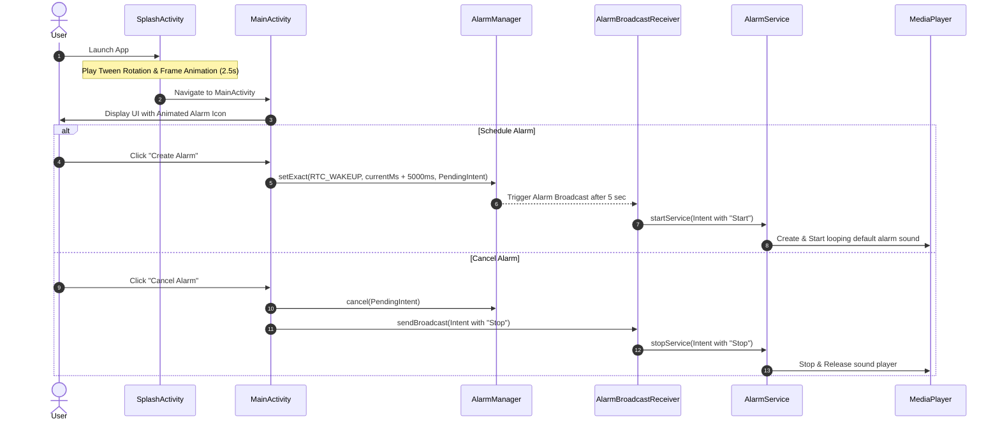

# ⏰ Android Animation & Alarm Management System

[](https://kotlinlang.org/)
[](https://developer.android.com/)
[](https://m3.material.io/)
[](https://gradle.org/)

An Android application demonstrating **Frame-by-Frame Animation**, **Tween Animation**, **AlarmManager**, **BroadcastReceiver**, and **Background Services** in Kotlin. Developed as part of the **Mobile Application Development (MAD) Practical 6** curriculum.

---

## 📌 Project Overview

This project showcases key Android fundamentals:
1. **Animations**:
   - **Tween Animation**: Smooth 360-degree rotation animation defined in XML (`twinanimation.xml`).
   - **Frame-by-Frame Animation**: Frame-based sequence animation using `AnimationDrawable` (`alarm_animation_list.xml` & `uvpce_animation_list.xml`).
2. **Alarm Scheduling & Background Service**:
   - Sets exact alarms using Android `AlarmManager`.
   - Listens to alarm trigger intents using a `BroadcastReceiver`.
   - Controls continuous audio playback (system alarm alert sound) using a foreground/background `Service` with `MediaPlayer`.

---

## ✨ Features

- 🚀 **Dynamic Animated Splash Screen (`SplashActivity`)**:
  - Displays UVPCE logo frame-by-frame animation combined with a 360° rotation tween animation.
  - Automatically transitions to `MainActivity` after 2.5 seconds.
- 🔔 **Interactive Alarm Controller (`MainActivity`)**:
  - Frame-by-frame animated alarm clock graphic running smoothly via `AnimationDrawable`.
  - **Create Alarm**: Schedules an exact alarm set for 5 seconds into the future using `AlarmManager`.
  - **Cancel Alarm**: Instantly stops the active alarm and background sound service.
- 🎵 **Background Audio Service (`AlarmService`)**:
  - Plays the default system alarm alert ringtone continuously (`isLooping = true`) via Android `MediaPlayer`.
- 🎨 **Modern Material 3 Design**:
  - Modern UI built with `ConstraintLayout`, `MaterialCardView`, and styled `MaterialButton` components.

---

## 🛠️ Tech Stack & Requirements

| Component | Specification |
| :--- | :--- |
| **Language** | Kotlin |
| **Min SDK** | API 36 |
| **Target SDK** | API 37 |
| **Build System** | Gradle (Kotlin DSL) |
| **Architecture** | Component-Based (Activities, Service, BroadcastReceiver) |
| **UI Components** | Material Components 3, ConstraintLayout, AnimationDrawable |

---

## 🏗️ Architecture & Component Flow



---

## 📁 Project Structure

```
com.example.a25012012037_mad_practical6
│
├── 📄 SplashActivity.kt          # Splash screen with Tween & Frame animations
├── 📄 MainActivity.kt            # Main user interface for creating & cancelling alarms
├── 📄 AlarmBroadcastReceiver.kt  # Receives AlarmManager intents and manages AlarmService
├── 📄 AlarmService.kt            # Background service playing alarm sound via MediaPlayer
│
├── 🎨 res/anim/
│   └── twinanimation.xml         # XML Tween Animation (360° rotation)
│
├── 🖼️ res/drawable/
│   ├── alarm_animation_list.xml  # Frame-by-frame animation list for alarm clock
│   ├── uvpce_animation_list.xml  # Frame-by-frame animation list for UVPCE logo
│   └── alarm1.jpg - alarm10.jpg  # Animation frame assets
│
└── 📐 res/layout/
    ├── activity_splash.xml       # Splash screen layout
    └── activity_main.xml         # Main activity layout with Material Card & Buttons
```

---

## 🔑 Permissions & Manifest Configuration

The application requires the following permissions declared in `AndroidManifest.xml`:

```xml
<!-- Permission required to schedule exact alarms on Android 12+ (API 31+) -->
<uses-permission android:name="android.permission.SCHEDULE_EXACT_ALARM" />
<uses-permission android:name="com.android.alarm.permission.SET_ALARM" />
```

---

## 🚀 How to Run & Build

1. **Clone or Open Project**:
   - Open Android Studio (Ladybug / Jellyfish or newer).
   - Choose `File > Open` and select the project folder `25012012037_MAD_PRACTICAL6`.

2. **Gradle Sync**:
   - Allow Gradle to download dependencies and sync the project structure automatically.

3. **Run on Emulator / Physical Device**:
   - Ensure an Android device or AVD running API 36+ is selected.
   - Click the green **Run** button (`Shift + F10`) or deploy via Android Studio.

---

## 🧑‍🎓 Student & Academic Details

- **Name**: Tilak Pandya
- **Enrollment Number**: `25012012037`
- **Class**: CE-H
- **Course**: Mobile Application Development (MAD)
- **Practical No**: 6
- **Institute**: UVPCE (U. V. Patel College of Engineering)

---

## 📄 License

This repository is created for educational and academic coursework purposes.

